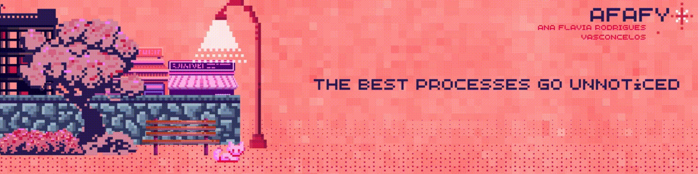

<!-- Animated Banner -->

  

<h1 align="center">✨ Ana Vasconcelos ✨</h1>

  <i>“The best processes go unnoticed, they simply flow.”</i> 
  <b>Project Analyst</b> 
  DevOps • SRE • Observability • Cloud

---

### 💗 ❯ About Me

Hi! I’m Ana — but feel free to call me *Aninha* 💗

  

I work as a **Project Analyst**. My focus is on:

- delivering structured cloud projects  
- building automation flows  
- writing aesthetic and functional documentation  
- supporting teams with clear and proactive processes  

I’m currently **deepening my skills** in **DevOps and SRE**, bringing together everything I value most: precision, consistency, and a touch of personality in everything I do.

> I believe in silent efficiency — the kind that just works.  

---

### 💗 ❯ Currently Improving

- **Git & GitHub** – version control with structure  
- **Linux** – personal journey via *Linux em Ação*  
- **Docker & Kubernetes** – building resilient environments  
- **AWS & Terraform** – reproducible cloud infrastructures  
- **Datadog** – logs, metrics, traces & SIEM  

📚 You can find all this organized in my themed repositories under `fromzero-tohero`.

---

### 💗 ❯ Featured Repositories

| 🌟 Repository | ✨ Description |
|--------------|----------------|
| [`fromzero-tohero-frontend`](https://github.com/aflaviarv/fromzero-tohero-frontend) | Front-end projects from the *Coding Future* bootcamp |
| [`fromzero-tohero-powershell`](https://github.com/aflaviarv/fromzero-tohero-powershell) | Practical PowerShell automation scripts |
| [`proserv-zapier-pytools`](https://github.com/aflaviarv/proserv-zapier-pytools) | Python tools to automate service flows at scale |

---

### 💗 ❯ Visual Identity

My branding brings **professionalism + softness** — because documentation can be structured *and* beautiful 💗

🌸 **Core style elements:**

- Pink gradient palette — from *baby blush* to *bold fuchsia*
- Pixel-inspired visuals — 2000's retro but elegant  
- Minimal layout with spacing that breathes  
- Consistency and clarity across docs and repos  
- A soft tone that keeps everything friendly, but focused

---

### 💗 ❯ Let’s Connect

- [LinkedIn](https://www.linkedin.com/in/aflaviarv/)  
- [GitHub](https://github.com/aflaviarv)  
- [Portfolio](https://github.com/aflaviarv) *(coming soon)*

---

## 💗 ❯ GitHub Stats (Omni Theme)

  

  

---

## 💗 ❯ GitHub Metrics (Omni Theme)

  
  
  
  
  
  

---

  <i>Crafted with clarity, consistency, and a touch of pink.</i>

